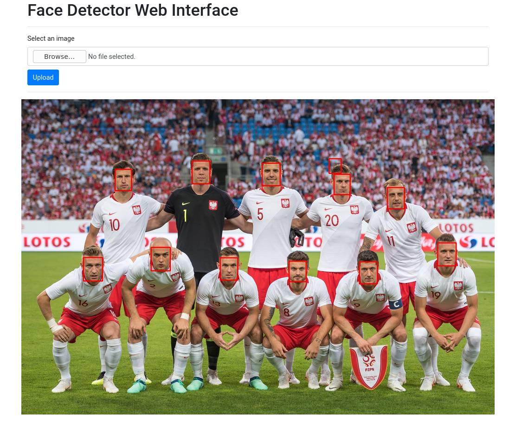

# Face Detection Service

A service providing REST API for face detection.

I created two endpoints:

* REST endpoint for "production" usage
* Web interface for easy result checking

The application uses Flask, OpenCV and Tensorflow. Detection is based on
the [MTCNN face detector](https://github.com/ipazc/mtcnn).

There is a dockerfile available that allows to build and run the application easily. The container deployment uses
gunicorn as a server.

I set up a simple CI using Github Actions. No docker image is pushed anywhere, but that's a possibility.

## Rationale

I wanted the service to be more or less "stateless", meaning that it should be easy horizontally scalable.
The service itself is simple, but it makes it easy to embed into more complex flow i.e. task queue or nginx web server.

Web interface is done simply to visualize results and isn't intended to be a "production" thing. 
I feel it's easier to look at images instead of just a JSON list of numbers.

The detector itself isn't perfect, but is pretty good. It also allows for some precision/recall tuning thanks
to confidence setting.

## Installation

### Docker
To build and run the application using docker-compose run:
`docker-compose -f docker-compose.yml up face_service`

By default, the application listens on the 8000 port.

### Manual install

```apt-get -y install build-essential gcc g++ python3-dev python3-opencv```

```pip install --trusted-host pypi.python.org -r requirements.txt```

Running with Flask:
```python3 main.py```

Running with Gunicorn:
```sh entrypoint.sh```


## Usage

### Web interface

Assuming that you have started the app locally, visit the: [http://localhost:8000](http://localhost:8000). 

You should see following interface:


Detection is applied immediately after uploading an image. Image itself is lightened a bit to make boxes more visible.

### REST API

```bash
curl --location --request POST 'localhost:8000/api/detect' \
--header 'Content-Type: image/jpeg' \
--data-binary '@examples/1.jpeg'
```

#### Example response

The service returns a JSON containing list of objects in a following form:

```[
    {
        "box": [
            1820,
            352,
            29,
            41
        ],
        "confidence": 0.7826327085494995,
        "keypoints": {
            "left_eye": [
                1832,
                368
            ],
            "right_eye": [
                1844,
                366
            ],
            "nose": [
                1840,
                375
            ],
            "mouth_left": [
                1834,
                384
            ],
            "mouth_right": [
                1843,
                383
            ]
        }
    }
]
```

Box format: `[x, y, width, height]`

Features format: `[x, y]`
